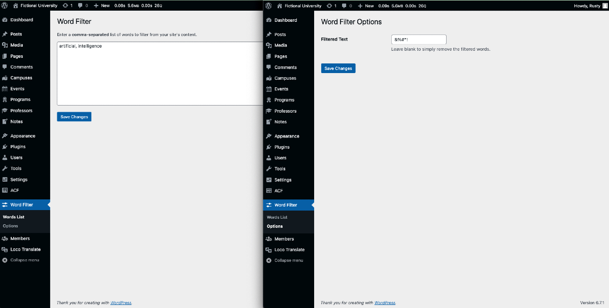

# Word Filter Plugin

[](https://wordpress.org/)
[](https://www.php.net/)
[](https://developer.wordpress.org/plugins/)

> **Word Filter Plugin** is a custom WordPress plugin designed to help you manage and filter unwanted words or phrases from your site's content. It provides a user-friendly interface for defining words to filter and customizable replacement options.

###



## 🚀 Features

- **Word Filtering:** Automatically replaces or removes unwanted words/phrases in your site's content.
- **Custom Replacement Text:** Define your own replacement text for filtered words.
- **Custom Parent Menu Title:** Modify the admin menu title to suit your preferences.
- **Custom SVG Icon:** Add your own custom SVG icon for the plugin's admin menu.
- **Custom Admin CSS:** Apply custom CSS styles to the plugin's admin pages for a polished look.
- **Admin Settings Page:** Easily manage your filtered words and replacement settings from the WordPress admin dashboard.
- **Seamless Integration:** Filters content on posts and pages without affecting performance.

### ✨ Admin Options

- **Words to Filter:** Add a comma-separated list of words or phrases to be filtered.
- **Replacement Text:** Customize the text to replace filtered words, or leave it blank to remove them.
- **Options Page:** Fine-tune plugin settings via the WordPress admin menu.
- **Custom Admin Styles:** Adjust the appearance of admin pages using CSS.
- **Custom Menu Icon:** Enhance branding by using a base64-encoded SVG icon.

## 🔧 How to Add a Custom SVG Icon

1. Open your browser's developer console.
2. Run the following command, replacing `svg code` with your actual SVG:
    ```javascript
    btoa(`svg code`)
    ```
3. Copy the resulting Base64-encoded string.
4. Add the encoded SVG to your plugin's PHP code where the admin menu is defined.

## 🛠️ Technologies Used

- **WordPress API**
- **PHP 8.1+**
- **HTML & CSS** for user interface elements
- **Custom Admin CSS**
- **SVG Icon** for menu design

## 🔧 Installation

1. Clone or download this repository:
    ```bash
    git clone https://github.com/jarutosurano/wpplugin-word-filter.git
    ```
2. Place the plugin folder inside the WordPress `wp-content/plugins` directory.
3. Activate the plugin in the WordPress admin panel under `Plugins > Installed Plugins`.

## 🧩 How to Use

1. Navigate to `Word Filter` in the WordPress admin menu.
2. Add a list of words or phrases to filter in the **Words List** submenu.
3. Configure replacement text in the **Options** submenu:
   - Define custom text to replace filtered words.
   - Leave the replacement field blank to remove the words entirely.
4. Customize the parent menu title, SVG icon, and admin styles by modifying the plugin settings.
5. Save your settings, and the plugin will automatically apply the filters to your site's content.

## 📖 License

This plugin is licensed under the MIT License. See the [LICENSE](LICENSE) file for more details.

## 💬 Feedback

Feedback, bug reports, and feature suggestions are welcome!  
📧 Email me at [jarutosurano@gmail.com](mailto:jarutosurano@gmail.com) or open an [issue](https://github.com/jarutosurano/wpplugin-word-filter/issues).

---

*Let's make WordPress a better place, one plugin at a time!*
